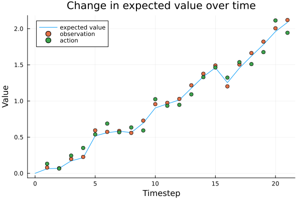

[](https://ComputationalPsychiatry.github.io/ActionModels.jl/stable/)
[](https://ComputationalPsychiatry.github.io/ActionModels.jl/dev/)
[](https://github.com/ComputationalPsychiatry/ActionModels.jl/actions/workflows/CI_full.yml?query=branch%3Amain)
[](https://codecov.io/gh/ComputationalPsychiatry/ActionModels.jl)
[](https://opensource.org/licenses/MIT)
[](https://github.com/JuliaTesting/Aqua.jl)

# Welcome to ActionModels!

ActionModels is a Julia package for computational modeling of cognition and behaviour.
It can be used to fit cognitive models to data, as well as to simulate behaviour.
ActionModels allows for easy specification of hiearchical models, as well as including generalized linear regressions of model parameters, using standard LMER syntax.
ActionModels makes it easy to specify new models, but also contains a growing library of precreated models, and can easily be extended to include more complex model families.
The package is designed to have functions for every step of a classic cognitive modelling framework, such as parameter recovery, predictive checks, and extracting trajectories of cognitive states for further analysis.
Inspired by packages like brms and HBayesDM, ActionModels is designed to provide a flexible but intuitive and easy-to-use interface for a field that is otherwise only accessible to technical experts. It also aims to facilitate thorough and fast development, testing and application of models.
Under the hood, ActionModels relies on Turing.jl, Julia's powerful framework for probabilistic modelling. However, by relying on Julia's native differentiatiability, users can easily specify custom models withut having to engage directly with Turing's API.
ActionModels is continuously being developed and optimised within the constraints of cognitive modelling. It allows for parallelizing models across experimental sessions, and can use Turing's composite samplers to estimate both continuous and discrete parameters.
The documentation covers all three main components of ActionModels: defining cognitive models, fitting them to data, and simulating behaviour, as well as suggestions for debugging models. It alspo includes a theory seciton with an introduction to computaional cognitive modelling and the conceptual framework that ActionModels is built on.
Finally, the CONTRIBUTING.md files describes how to extend or contribute to ActionModels to include new models.

# Getting Started

First we load the ActionModels package

````julia
using ActionModels
````

We can now quickly define a cognitive model. We write a function that describes the action selection process in a single timestep.
Here we create the classic Rescorla-Wagner model, with a Gaussian-noise report as action:

````julia
function rescorla_wagner(attributes::ModelAttributes, observation::Float64)
    #Read in parameters and states
    parameters = load_parameters(attributes)
    states = load_states(attributes)

    α = parameters.learning_rate
    β = parameters.action_noise
    Vₜ₋₁ = states.expected_value

    #The Rescorla-Wagner update rule updates the expected value V
    #based on the observation and the learning rate α
    Vₜ = Vₜ₋₁ + α * (observation - Vₜ₋₁)

    #The updated expected value is stored to be accessed on next timestep
    update_state!(attributes, :expected_value, Vₜ)

    #The probability distribution for the action on this timestep
    #is a Gaussian with the expected value V as mean, and a noise parameter β as standard deviation
    action_distribution = Normal(Vₜ, β)

    return action_distribution
end;
````

We now create the model object.
We first define the attributes of the Rescorla Wagner model. This includes it's three parameters, the expected value state, the observation and the action.
Then we use the `ActionModel` constructor to create the model object.

````julia
parameters = (
    #The learning rate, with a default value of 0.1
    learning_rate = Parameter(0.1),
    #The action noise, with a default value of 1
    action_noise = Parameter(1),
    #And the initial expected value V₀, with a default value of 0
    initial_value = InitialStateParameter(0, :expected_value),
)
states = (;
    #The expected value V, which is updated on each timestep
    expected_value = State(),
)
observations = (;
    #The observation, which is passed to the model on each timestep and used to update V
    observation = Observation()
)
actions = (;
    #The report action, which reports the expected value with Gaussian noise
    report = Action(Normal)
)

action_model = ActionModel(
    rescorla_wagner,
    parameters = parameters,
    states = states,
    observations = observations,
    actions = actions,
)
````

````
-- ActionModel --
Action model function: rescorla_wagner
Number of parameters: 3
Number of states: 1
Number of observations: 1
Number of actions: 1

````

We can now read in a dataset. In this example, we will use a simple hand-created dataset, where three participants each have stated predictions after each of 6 observations, under some treatment condition as well as in a control condition.

````julia
using DataFrames

data = DataFrame(
    observations = repeat([1.0, 1, 1, 2, 2, 2], 6),
    actions = vcat(
        [0, 0.2, 0.3, 0.4, 0.5, 0.6],
        [0, 0.5, 0.8, 1, 1.5, 1.8],
        [0, 2, 0.5, 4, 5, 3],
        [0, 0.1, 0.15, 0.2, 0.25, 0.3],
        [0, 0.2, 0.4, 0.7, 1.0, 1.1],
        [0, 2, 0.5, 4, 5, 3],
    ),
    id = vcat(
        repeat(["A"], 6),
        repeat(["B"], 6),
        repeat(["C"], 6),
        repeat(["A"], 6),
        repeat(["B"], 6),
        repeat(["C"], 6),
    ),
    treatment = vcat(repeat(["control"], 18), repeat(["treatment"], 18)),
)

show(data)
````

````
36×4 DataFrame
 Row │ observations  actions  id      treatment
     │ Float64       Float64  String  String
─────┼──────────────────────────────────────────
   1 │          1.0      0.0  A       control
   2 │          1.0      0.2  A       control
   3 │          1.0      0.3  A       control
   4 │          2.0      0.4  A       control
   5 │          2.0      0.5  A       control
   6 │          2.0      0.6  A       control
   7 │          1.0      0.0  B       control
   8 │          1.0      0.5  B       control
  ⋮  │      ⋮           ⋮       ⋮         ⋮
  30 │          2.0      1.1  B       treatment
  31 │          1.0      0.0  C       treatment
  32 │          1.0      2.0  C       treatment
  33 │          1.0      0.5  C       treatment
  34 │          2.0      4.0  C       treatment
  35 │          2.0      5.0  C       treatment
  36 │          2.0      3.0  C       treatment
                                 21 rows omitted
````

We can now create a model for estimating parameters hierarchically for each participant.
We make a regression model where we estimate how much the learning rate and action noise differ between treatment conditions.
We include a random intercept for each participant, making this a hierarchical model.
The initial value parameter is not estimated, and is fixed to it's default: 0.

````julia
population_model = [
    Regression(@formula(learning_rate ~ treatment + (1 | id)), logistic), #use a logistic link function to ensure that the learning rate is between 0 and 1
    Regression(@formula(action_noise ~ treatment + (1 | id)), exp),        #use an exponential link function to ensure that the action noise is positive
]

model = create_model(
    action_model,
    population_model,
    data;
    action_cols = :actions,
    observation_cols = :observations,
    session_cols = [:id, :treatment],
)
````

````
-- ModelFit object --
Action model: rescorla_wagner
Linear regression population model
2 estimated action model parameters, 6 sessions
Posterior not sampled
Prior not sampled

````

We can now fit the model to the data:

````julia
#Load statsplots for plotting results
using StatsPlots

#Fit the model to the data
chns = sample_posterior!(model)
#We can plot the estimated parameters
plot(chns[[Symbol("learning_rate.β[1]"), Symbol("learning_rate.β[2]"), Symbol("action_noise.β[1]"), Symbol("action_noise.β[2]")]])
````


We can extract the estimated parameters for each participant, and summarize it as a dataframe for further analysis:

````julia
#Extract the full distribution of parameters for each participant
parameters_per_session = get_session_parameters!(model)
#Populate a dataframe with the median of each posterior distribution
summarized_parameters = summarize(parameters_per_session, median)

show(summarized_parameters)
#TODO: plot
````

````
6×4 DataFrame
 Row │ id      treatment  action_noise  learning_rate
     │ String  String     Float64       Float64
─────┼────────────────────────────────────────────────
   1 │ A       control       0.0540497      0.0830818
   2 │ B       control       0.1761         0.322529
   3 │ C       control       2.23036        0.842322
   4 │ A       treatment     0.0370277      0.0381213
   5 │ B       treatment     0.122187       0.17241
   6 │ C       treatment     1.53131        0.701624
````

We can also extract the estimated value of V at each timestep, for each participant:

````julia
#Extract the estimated trajectory of V
state_trajectories = get_state_trajectories!(model, :expected_value)
#Summarize the trajectories
summarized_trajectories = summarize(state_trajectories, median)

show(summarized_trajectories)
#TODO: plot
````

````
42×4 DataFrame
 Row │ id      treatment  timestep  expected_value
     │ String  String     Int64     Float64?
─────┼─────────────────────────────────────────────
   1 │ A       control           0       0.0
   2 │ A       control           1       0.0830818
   3 │ A       control           2       0.159261
   4 │ A       control           3       0.229111
   5 │ A       control           4       0.37624
   6 │ A       control           5       0.511145
   7 │ A       control           6       0.634841
   8 │ B       control           0       0.0
  ⋮  │   ⋮         ⋮         ⋮            ⋮
  36 │ C       treatment         0       0.0
  37 │ C       treatment         1       0.701624
  38 │ C       treatment         2       0.910971
  39 │ C       treatment         3       0.973436
  40 │ C       treatment         4       1.6937
  41 │ C       treatment         5       1.90861
  42 │ C       treatment         6       1.97273
                                    27 rows omitted
````

Finally, we can also simulate behaviour using the model.
First we instantiate an Agent object, which produces actions according to the action model.
Additionally, we can specify which states to save in the history of the agent.

````julia
#Create an agent object
agent = init_agent(action_model, save_history = [:expected_value])
````

````
-- ActionModels Agent --
Action model: rescorla_wagner
This agent has received 0 observations

````

We can set parameter values for the agent, and simulate behaviour for some set of observations

````julia
#Set the parameters of the agent
set_parameters!(agent, (learning_rate = 0.8, action_noise = 0.1))

#Create an increasing set of observations with some noise
observations = collect(0:0.1:2) .+ randn(21) * 0.1

#Simulate behaviour
simulated_actions = simulate!(agent, observations)

#Plot the change in expected value over time
plot(agent, :expected_value, label = "expected value", ylabel = "Value")
plot!(observations, linetype = :scatter, label = "observation")
plot!(simulated_actions, linetype = :scatter, label = "action")
title!("Change in expected value over time")
````


---

*This page was generated using [Literate.jl](https://github.com/fredrikekre/Literate.jl).*

