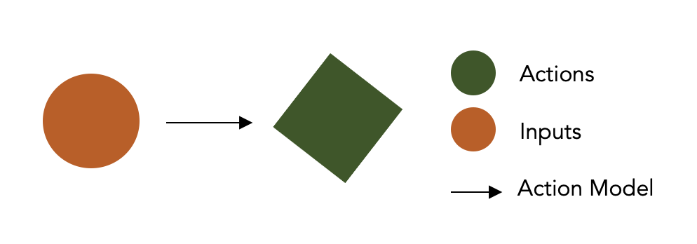
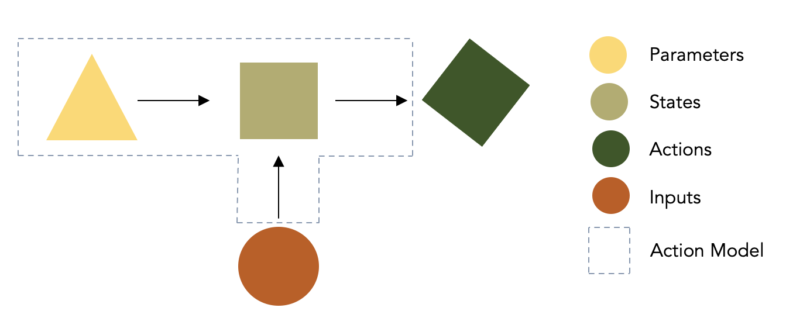

# Agents, states and action models

As a very general structue we can illustrate the relation between input and action/response as below. 

*We can generate actions based on inputs. How we use the input to generate actions happens according to the action model*

An action model is a *way* of assuming how an agents actions are generated from inputs. An action model can be modulated according to a specific experimental use or how we assume a specific agent operates. 

The mapping between inputs and actions can be extended. We will add the following elements which all action models operate with: parameters and states. The new expanded version is seen below.

*We can extend the action model arrow with parameters and states. Parameters are stable and contribute as constants to the system. States change and evolve according to input and parameters (the way states change happens accordingly to the structure of the action model).*

When defining an agent, you also have to define an action model for the agent to use. you also define the states, parameters, and an optional substruct (see [advanced usage](Advanced_use/../../Advanced_use/complicated_custom_agents.md)) of the agent. 

We will introduce a very standard reinforcement learning action model, the binary Rescorla-Wagner softmax. The parameters in this model are learning rate and action precision. The states of the agent, who produces actions according to the Rescorla-Wagner softmax action model, are "value", "transformed value" and "action probability". 

----SOMETHING MORE ON RW ----- ?

When initializing an agent, we may in some cases need a starting value for certain states. These initial values are categorized as an 'initial state parameter'. In the premade Rescorla-Wagner agent the "value" state is initialized at 0 by default. The learning rate parameter and the action presicion are both set to 1. 

The transformed value is calculated based on the input value (in the first run the initial state parameter for the "value" state) as seen in the equation below. In the first run the old value is equal to the initial state value. 

$transformed \; old \; value = \frac{1}{1+exp(-old \; value)}$ 

From this we can compute the new value from which an action probability can be calculated.

$new \;value = old \; value + learning \; rate \cdot (input - transformed \;old \; value)$

$Action\; probability =  \frac{1}{1+exp(-action \; precision \cdot new \; value)}$

The last state "action probability" is the mean of an Bernoulli distribution from which an action can be sampled.

An agent is defined with a set of states and parameters. The action model defines through equations with  how the states change according to inputs, updates the history of an agent (its states), and returns an action distribution. 

The process described above is what we define as simulating actions. We know the inputs, parameters and states of the agent and returns actions. We can reverse this process and infer the parameters of an agent based on their actions in response to inputs. 

This will be further elaborated in [fitting vs. simulating](./fitting_vs_simulating.md)

